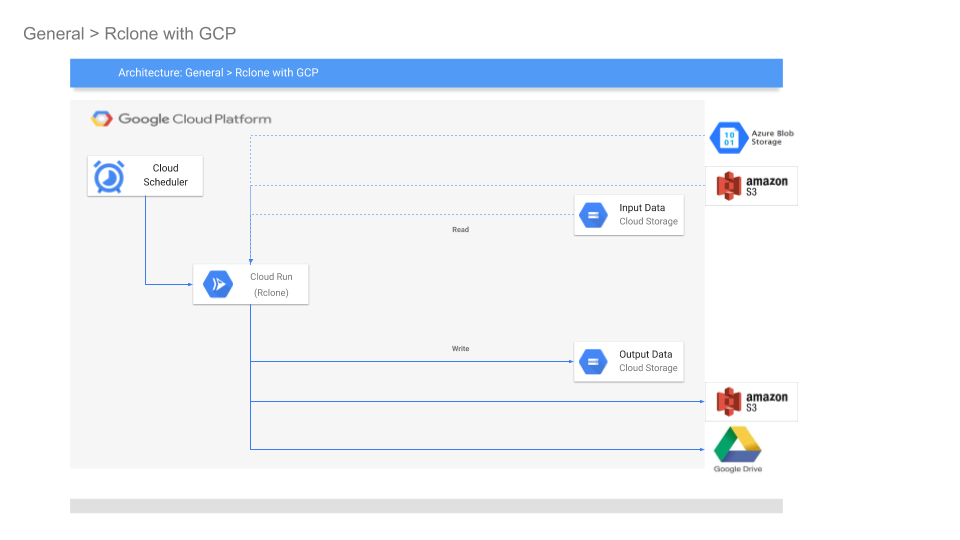

## Rclone Storage bucket sync using Cloud Scheduler and Cloud Run

Basic tutorial ty synchronize contents of two Object Storage buckets using [Rclone](https://rclone.org/) on Google Cloud.

The specific implementation here uses GCS Buckets as the source and destination but it would be relatively simple extension to other backend storage providers.  For example, an AWS `S3` configuration as source bucket is shown in the Appendix section.

>> This repository is NOT supported by Google.

This utility has not been tested at scale.  Since the synchronization iterates files, it will not scale with very large numbers of objects or where each file transfer exceeds the default timeout of Cloud Run (15mins).  However, there are techniques you can use to shard the iteration using Cloud Tasks across various Cloud Run instances.  This is described at the end of the tutorial.

### Architecture

This tutorial will setup Rclone source and destination configurations on [Cloud Run](https://cloud.google.com/run).  

[Cloud Scheduler](https://cloud.google.com/scheduler/docs) is configured make [authenticated http triggers](https://cloud.google.com/scheduler/docs/http-target-auth) on Cloud Run to initiate synchronization



For more information, see [Automatic OIDC: Using Cloud Scheduler, Tasks, and PubSub to make authenticated calls to Cloud Run, Cloud Functions or your Server](https://medium.com/google-cloud/automatic-oidc-using-cloud-scheduler-tasks-and-pubsub-to-make-authenticated-calls-to-cloud-run-de9e7e9cec3f)

The Cloud Run instance uses GCS as the only Rclone FileSystem provider, in `server.go`:
```golang
	// Configure the source and destination
	fs.ConfigFileSet("gcs-src", "type", "google cloud storage")
	fs.ConfigFileSet("gcs-src", "bucket_policy_only", "true")
```
As mentioned, you can configure other source and destinations Rclone supports as well.

### Setup

1. Configure Service Accounts Cloud Run and Cloud Scheduler:

```bash
export PROJECT_ID=`gcloud config get-value core/project`
export PROJECT_NUMBER=`gcloud projects describe $PROJECT_ID --format="value(projectNumber)"`
export REGION=us-central1

export RSYNC_SERVER_SERVICE_ACCOUNT=rsync-sa@$PROJECT_ID.iam.gserviceaccount.com
export RSYNC_SRC=$PROJECT_ID-rsync-src
export RSYNC_DEST=$PROJECT_ID-rsync-dest

gcloud iam service-accounts create rsync-sa --display-name "RSYNC Service Account" --project $PROJECT_ID

export SCHEDULER_SERVER_SERVICE_ACCOUNT=rsync-scheduler@$PROJECT_ID.iam.gserviceaccount.com

gcloud iam service-accounts create rsync-scheduler --display-name "RSYNC Scheduler Account" --project $PROJECT_ID
```

2. Configure source and destination GCS Buckets

Configure [Uniform Bucket Access Policy](https://cloud.google.com/storage/docs/uniform-bucket-level-access)

```bash
gsutil mb gs://$RSYNC_SRC
gsutil mb gs://$RSYNC_DEST

gsutil iam ch serviceAccount:$RSYNC_SERVER_SERVICE_ACCOUNT:objectViewer gs://$RSYNC_SRC
gsutil iam ch serviceAccount:$RSYNC_SERVER_SERVICE_ACCOUNT:objectViewer,objectCreator,objectAdmin gs://$RSYNC_DEST
```

3. Build and deploy Cloud Run image

The `server.go` as an extra secondary check for the audience value that the Cloud Scheduler sends.  This is not a necessary step since Cloud Run checks the audience value by itself automatically (see [Authenticating service-to-service](https://cloud.google.com/run/docs/authenticating/overview)).

This secondary check is left in to accommodate running the service on any other platform.

To deploy, we first need to find out the URL for the Cloud Run instance. 

First build and deploy the cloud run instance (dont' worry about the `AUDIENCE` value below)

```bash
docker build -t gcr.io/$PROJECT_ID/rsync  .

docker push gcr.io/$PROJECT_ID/rsync

gcloud beta run deploy rsync  --image gcr.io/$PROJECT_ID/rsync \
  --set-env-vars AUDIENCE="https://rsync-random-uc.a.run.app" \
  --set-env-vars GCS_SRC=$RSYNC_SRC \
  --set-env-vars GCS_DEST=$RSYNC_DEST \
  --region $REGION  --platform=managed \
  --no-allow-unauthenticated \
  --service-account $RSYNC_SERVER_SERVICE_ACCOUNT
```

Get the URL and redeploy

```bash
export AUDIENCE=`gcloud beta run services describe rsync --platform=managed --region=$REGION --format="value(status.address.url)"`

gcloud beta run deploy rsync  --image gcr.io/$PROJECT_ID/rsync \
  --set-env-vars AUDIENCE="$AUDIENCE" \
  --set-env-vars GCS_SRC=$RSYNC_SRC \
  --set-env-vars GCS_DEST=$RSYNC_DEST \
  --region $REGION  --platform=managed \
  --no-allow-unauthenticated \
  --service-account $RSYNC_SERVER_SERVICE_ACCOUNT
```

Configure IAM permissions for the Scheduler to invoke Cloud Run:

```bash
gcloud run services add-iam-policy-binding rsync --region $REGION  --platform=managed \
  --member=serviceAccount:$SCHEDULER_SERVER_SERVICE_ACCOUNT \
  --role=roles/run.invoker
```

4. Deploy Cloud Scheduler

First allow Cloud Scheduler to assume its own service accounts OIDC Token:

```bash
envsubst < "bindings.tmpl" > "bindings.json"
```

Where the bindings file will have the root service account for Cloud Scheduler:
- bindings.tmpl:
```yaml
{
  "bindings": [
    {
      "members": [
        "serviceAccount:service-$PROJECT_NUMBER@gcp-sa-cloudscheduler.iam.gserviceaccount.com"
      ],
      "role": "roles/cloudscheduler.serviceAgent"
    }    
  ],
}
```

Assign the IAM permission and schedule the JOB to execute every 5mins:

```bash
gcloud iam service-accounts set-iam-policy $SCHEDULER_SERVER_SERVICE_ACCOUNT  bindings.json  -q

gcloud beta scheduler jobs create http rsync-schedule  --schedule "*/5 * * * *" --http-method=GET \
  --uri=$AUDIENCE \
  --oidc-service-account-email=$SCHEDULER_SERVER_SERVICE_ACCOUNT   \
  --oidc-token-audience=$AUDIENCE
```

### Verify

Test by uploading a set of files to `RSYNC_SRC` bucket and in 5minutes check `RSYNC_DEST` for the same files. For the impatient, you can click "Run Now" button on Cloud Scheduler Cloud Console screen.

---

### Appendix

The following section details some options you have with respect to embedding Secrets for using other providers like AWS S3

#### Filtered and Prefix Transfer

Rclone configurations can be configured for path-based filters on source and destinations.

For example, the following Rclone CLI will transfer files of type  to a destination prefix:

- [Rclone Filter](https://rclone.org/filtering/)
- [Rclone Directories](https://rclone.org/filtering/#directories)

#### Sharded Transfers with Filters

Filtered transfer can also be employed to shard the input file sequences.  That is, if you have 100K objects to synchronize which are lexically evenly distributed, you can setup prefixed transfers based on the distribution range of the files (i.e., transfer files with prefix "a*", then "b*" and so on).  You can dispatch each shard on its own new Cloud Run service through Cloud Tasks.  

In this mode, the architecture is

`Cloud Scheduler` -> `Cloud Run (dispatch to N Shards)`  -> N(`Cloud Tasks`) -> N(`Cloud Run(prefix)` -> N(Read Prefix->Write Prefix)

You can find a similar Sharding technique here: [Yet another image file converter on GCP](https://github.com/salrashid123/image_file_converter)

#### Embedding Secrets

If you need to embed Storage object secrets like AWS `ACCESS_KEY_ID` values within Cloud Run, consider using [Google Cloud Secret Manager](https://cloud.google.com/secret-manager).  You will need to first upload the secret, give IAM permissions to read it to Cloud Run.

```bash
export AWS_ACCESS_KEY_ID=...
export AWS_SECRET_ACCESS_KEY=...

gcloud beta secrets create access_key_id \
  --replication-policy=automatic \
  --data-file=$AWS_ACCESS_KEY_ID --project $PROJECT_ID -q

gcloud beta secrets add-iam-policy-binding access_key_id \
  --member=serviceAccount:$RSYNC_SERVER_SERVICE_ACCOUNT \
  --role=roles/secretmanager.secretAccessor  \
  --project $PROJECT_ID -q  


gcloud beta secrets create secret_access_key \
  --replication-policy=automatic \
  --data-file=$AWS_SECRET_ACCESS_KEY --project $PROJECT_ID -q

gcloud beta secrets add-iam-policy-binding secret_access_key \
  --member=serviceAccount:$RSYNC_SERVER_SERVICE_ACCOUNT \
  --role=roles/secretmanager.secretAccessor  \
  --project $PROJECT_ID -q  
```
 

### Event-based File Synchronizing 

The default configuration in this repo uses time based synchronization based on triggers from Cloud Scheduler.  You can also re-factor `server.go` to be event driven. 

For example you can trigger synchronization if a file in the Source Bucket has been modified:

Via A) GCS Object Change Notification

- [Object Change Notification](https://cloud.google.com/storage/docs/object-change-notification)

or

B) A source system which emits [Cloud Events](https://cloudevents.io/)

To use Cloud Run with a system that emits Cloud Events, you may need to "convert" the inbound request to an Event.

The following describes GCP PubSub messages and raw `AuditLogs` parsing as both HTTP handlers or HTTP Handlers to Cloud Events:
- [HTTP Handler](https://gist.github.com/salrashid123/92adfda447f3c023efdaf6c320603aa1#file-main-go-L53)
- [Cloud Events Object](https://gist.github.com/salrashid123/f78ff7612dd10f4701702b07a688eb72#file-main-go-L28)

### Configure AWS Source/Destinations

To configure Rclone for `S3`, see [Amazon S3 Storage Provider](https://rclone.org/s3/).

Specifically, configure the startup of the rclone cloud run instance to use the AWS S3 `access_key_id` and `secret_access_key`.

You can bootstrap the Cloud Run instance using GCP Secrets

For example, if you have an AWS Bucket, first verify that you can access the bucket using a sample before deploying to Cloud Run

- `rclone.conf`

```conf
[gcs-src]
type = google cloud storage
bucket_policy_only = true

[aws-src]
type = s3
provider = AWS
env_auth = false
access_key_id = ...
secret_access_key = ...
region = us-east-2
```

```bash
$ ./rclone ls gcs-src:mineral-minutia-820-rsync-dest
$

$ ./rclone ls aws-src:mineral-minutia
      411 README.md

$ ./rclone sync  aws-src:mineral-minutia gcs-src:mineral-minutia-820-rsync-dest

$ ./rclone ls gcs-src:mineral-minutia-820-rsync-dest
      411 README.md
```

Once you have verified the above, map the `rclone.conf` file settings into `server.go`
